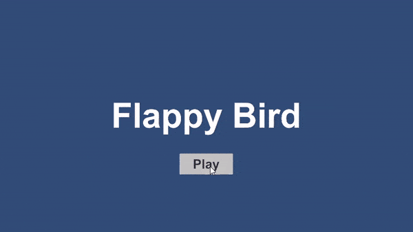

# FlappyBird

Welcome to the Flappy Bird Remake! This project is a recreation of the classic Flappy Bird game using Unity. The aim of the game is to navigate the bird through a series of pipes without colliding with them. This project is built with the intention to learn and demonstrate Unity game development skills.

## Table of Contents
- [Features](#features)
- [Installation](#installation)
- [Gameplay](#gameplay)
- [Screenshots](#screenshots)
- [Technologies Used](#technologies-used)
- [Contributing](#contributing)
- [License](#license)
- [Contact](#contact)

## Features
- Classic Flappy Bird gameplay
- Simple and intuitive controls
- Dynamic pipe generation
- Score tracking
- Collision detection and game over logic
- Attractive graphics and animations

## Installation
To run this project locally, follow these steps:

1. Clone the repository
    ```bash
    git clone https://github.com/yourusername/flappy-bird-remake.git
    ```
2. Open the project in Unity
3. Load the `MainScene` scene
4. Press the Play button in the Unity Editor

## Gameplay
- **Objective**: Navigate the bird through the gaps in the pipes to score points.
- **Controls**: Click or tap the screen to make the bird fly higher.
- **Game Over**: The game ends when the bird collides with a pipe or the ground.

## Screenshots


## Technologies Used
- Unity
- C#
- Visual Studio

## Contributing
Contributions are welcome! If you'd like to contribute, please follow these steps:

1. Fork the repository
2. Create a new branch (`git checkout -b feature/YourFeature`)
3. Commit your changes (`git commit -m 'Add some feature'`)
4. Push to the branch (`git push origin feature/YourFeature`)
5. Create a new Pull Request

## License
This project is licensed under the MIT License - see the [LICENSE](LICENSE) file for details.

## Contact
If you have any questions or suggestions, feel free to reach out!

- Email: vicky16898@gmail.com
- GitHub: [vicky16898](https://github.com/vicky16898)

---

Thank you for checking out the Flappy Bird Remake project! Happy gaming!

